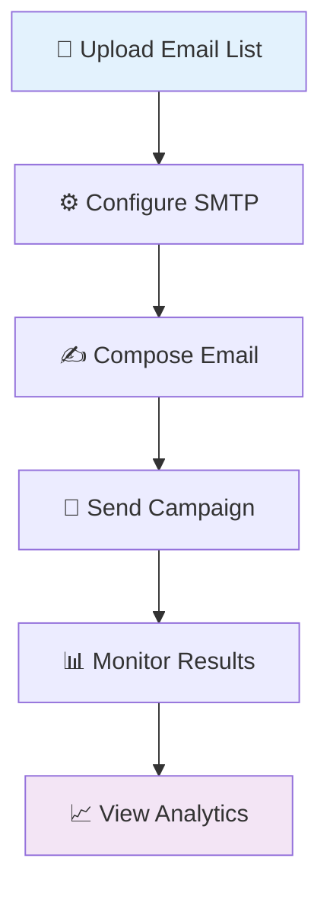

# 📧 BulkMail Pro.

<div align="center">


**Professional Bulk Email Campaign Management System** 🚀

[](https://flask.palletsprojects.com)
[](https://python.org)
[](https://sqlite.org)
[](LICENSE)

---

*Streamline your email marketing campaigns with enterprise-grade bulk email management* ✨

[🚀 Quick Start](#-installation) • [✨ Features](#-features) • [📖 Usage](#-usage) • [🤝 Contributing](#-contributing)

</div>

---

## 📋 About

**BulkMail Pro** is a powerful Flask-based web application designed to revolutionize your email marketing campaigns. Built with scalability and user experience in mind, it provides a comprehensive solution for managing bulk email operations with professional-grade features.

---

## ✨ Features

### 🔐 **Authentication & Security**
- **Secure Login System**: Robust user authentication with session management
- **User Registration**: Easy signup process with email verification
- **Password Reset**: Secure password recovery functionality
- **Role-Based Access**: Admin and user privilege management

### 👨‍💼 **Admin Dashboard**
- **User Management**: Complete control over user accounts and permissions
- **Activity Monitoring**: Real-time tracking of user actions and system events
- **Email Analytics**: Comprehensive logs of all email campaigns and delivery status
- **System Oversight**: Monitor application performance and usage statistics

### 📤 **Email Management**
- **SMTP Configuration**: Custom SMTP settings for each user account
- **Bulk Email Sending**: Efficient processing of large email lists
- **File Upload Support**: Extract email addresses from text files automatically
- **Campaign Tracking**: Monitor email delivery status and engagement metrics

### 🛠️ **System Features**
- **File Management**: Automatic cleanup of temporary uploads
- **Activity Logging**: Detailed audit trail of all user actions
- **Database Management**: SQLite integration with migration support
- **Environment Configuration**: Secure handling of sensitive credentials

---

## 🚀 Installation

### 📋 **Prerequisites**
- Python 3.7 or higher
- pip package manager
- Git

### 🔧 **Setup Process**

```bash
# 1️⃣ Clone the Repository
git clone https://github.com/khaliduzzamantanoy/bulkmail.git
cd bulkmail

# 2️⃣ Set Up Virtual Environment
python -m venv venv
source venv/bin/activate  # On Windows: venv\Scripts\activate

# 3️⃣ Install Dependencies
pip install -r requirements.txt
```

### ⚙️ **Environment Configuration**

Create a `.env` file in the root directory:

```env
# 🔑 Security Configuration
SECRET_KEY=your-super-secret-key-here

# 📧 SMTP Settings
SMTP_SERVER=smtp.gmail.com
SMTP_PORT=587
SMTP_EMAIL=your-email@gmail.com
SMTP_PASSWORD=your-app-password

# 🗄️ Database Configuration (Optional)
DATABASE_URL=sqlite:///instance/users.db
```

### 🗄️ **Database Setup**

```bash
# Initialize database migrations
flask db init

# Create initial migration
flask db migrate -m "Initial migration"

# Apply migrations to database
flask db upgrade
```

### 🚀 **Launch Application**

```bash
# Start the development server
python app.py
```

🌐 **Access your application at:** `http://localhost:5000`

---

## 📖 Usage

### 🏠 **Getting Started**

| Step | Action | Description |
|------|--------|-------------|
| 1️⃣ | **Access Application** | Navigate to `http://localhost:5000` |
| 2️⃣ | **Create Account** | Register a new user account |
| 3️⃣ | **Configure SMTP** | Set up your email server settings in `/account` |
| 4️⃣ | **Upload Email List** | Upload `.txt` file with email addresses |
| 5️⃣ | **Send Campaign** | Launch your bulk email campaign |

### 👨‍💼 **Admin Panel**

Access the admin dashboard at `/admin` to:
- 👥 Manage user accounts and permissions
- 📊 View detailed activity logs
- 📧 Monitor email campaign performance
- 🔍 Analyze system usage statistics

### 📤 **Email Campaign Process**



### 📝 **Email List Format**

Create a `.txt` file with one email address per line:

```txt
user1@example.com
user2@example.com
user3@example.com
marketing@company.com
```

---

## 🛠️ Tech Stack

| Component | Technology | Purpose |
|-----------|------------|---------|
| 🐍 **Backend** | Flask | Web framework and API |
| 🗄️ **Database** | SQLite | Data storage and management |
| 🎨 **Frontend** | HTML/CSS/JS | User interface |
| 📧 **Email** | SMTP | Email delivery system |
| 🔐 **Authentication** | Flask-Login | Session management |
| 📊 **Migration** | Flask-Migrate | Database versioning |

---

## 🔧 Configuration

### 📧 **SMTP Providers**

<details>
<summary>📮 <strong>Popular SMTP Configuration Examples</strong></summary>

#### Gmail
```env
SMTP_SERVER=smtp.gmail.com
SMTP_PORT=587
SMTP_EMAIL=your-email@gmail.com
SMTP_PASSWORD=your-app-password
```

#### Outlook
```env
SMTP_SERVER=smtp-mail.outlook.com
SMTP_PORT=587
SMTP_EMAIL=your-email@outlook.com
SMTP_PASSWORD=your-password
```

#### Yahoo
```env
SMTP_SERVER=smtp.mail.yahoo.com
SMTP_PORT=587
SMTP_EMAIL=your-email@yahoo.com
SMTP_PASSWORD=your-app-password
```

</details>

### 🔒 **Security Best Practices**

- 🔑 Use strong, unique SECRET_KEY
- 🚫 Never commit `.env` file to version control
- 🔐 Use app-specific passwords for email providers
- 🛡️ Enable 2FA on email accounts
- 📊 Regularly monitor activity logs

---

## 🚀 Deployment

### 🌐 **Production Deployment**

<details>
<summary>☁️ <strong>Deploy to Heroku</strong></summary>

```bash
# Install Heroku CLI and login
heroku login

# Create new Heroku app
heroku create your-bulkmail-app

# Set environment variables
heroku config:set SECRET_KEY=your-secret-key
heroku config:set SMTP_SERVER=smtp.gmail.com
heroku config:set SMTP_PORT=587
heroku config:set SMTP_EMAIL=your-email@gmail.com
heroku config:set SMTP_PASSWORD=your-password

# Deploy application
git push heroku main

# Run database migrations
heroku run flask db upgrade
```

</details>

### 🐳 **Docker Deployment**

<details>
<summary>🔧 <strong>Docker Configuration</strong></summary>

```dockerfile
FROM python:3.9-slim

WORKDIR /app

COPY requirements.txt .
RUN pip install -r requirements.txt

COPY . .

EXPOSE 5000

CMD ["gunicorn", "--bind", "0.0.0.0:5000", "app:app"]
```

</details>

---

## 🤝 Contributing

<div align="center">

**We welcome contributions from the community!** 🌟

[](https://github.com/khaliduzzamantanoy/bulkmail/graphs/contributors)

</div>

### 🔄 **How to Contribute**

```bash
# 1. 🍴 Fork the repository
# 2. 📥 Clone your fork
git clone https://github.com/YOUR_USERNAME/bulkmail.git

# 3. 🌿 Create feature branch
git checkout -b feature/YourFeatureName

# 4. ✨ Make your changes
# 5. 💾 Commit changes
git commit -m 'Add some feature'

# 6. 🚀 Push to branch
git push origin feature/YourFeatureName

# 7. 🎉 Open a pull request
```

### 📋 **Contribution Guidelines**

- 🐛 **Bug Reports**: Use issue templates with detailed descriptions
- ✨ **Feature Requests**: Discuss new features in issues first
- 📝 **Code Style**: Follow PEP 8 guidelines
- 🧪 **Testing**: Add tests for new functionality
- 📖 **Documentation**: Update docs for any changes

---

## 📊 Project Statistics

<div align="center">


### 📈 **Activity**


</div>

---

## 📄 License

<div align="center">

This project is licensed under the **MIT License** 📜

[](https://opensource.org/licenses/MIT)

*Feel free to use, modify, and distribute this project* ✨

</div>

---

## ⚠️ Important Notes

### 🔒 **Security Considerations**
- 🔐 Store all sensitive credentials in environment variables
- 🚫 Never hardcode passwords or API keys in source code
- 🛡️ Use HTTPS in production environments
- 📊 Regularly audit activity logs for suspicious behavior

### 🏭 **Production Recommendations**
- 🚀 Use Gunicorn or uWSGI for production deployment
- 🌐 Deploy on reliable platforms (Heroku, AWS, DigitalOcean)
- 💾 Implement regular database backups
- 📈 Set up monitoring and logging systems

### 🗄️ **Database Management**
- 💾 **Backup Location**: `instance/users.db`
- 🔄 **Migration Commands**: Use Flask-Migrate for schema changes
- 📊 **Monitoring**: Check database size and performance regularly

---

## 💬 Support

<div align="center">

### 🆘 **Get Help**

| 📞 Support Channel | 🔗 Link | 📝 Description |
|------------------|---------|----------------|
| 🐛 **Issues** | [GitHub Issues](https://github.com/khaliduzzamantanoy/bulkmail/issues) | Bug reports and technical issues |
| 💡 **Discussions** | [GitHub Discussions](https://github.com/khaliduzzamantanoy/bulkmail/discussions) | Feature requests and general questions |
| 📧 **Email** | [Contact](mailto:support@bulkmailpro.com) | Direct support for urgent issues |

**⭐ If this project helped you, please give it a star!**

[](https://github.com/khaliduzzamantanoy/bulkmail/stargazers)

</div>

---

<div align="center">

**Made with ❤️ by [Khaliduzzaman Tanoy](https://github.com/khaliduzzamantanoy)**

*BulkMail Pro - Professional Email Marketing Made Simple* 📧

</div>
